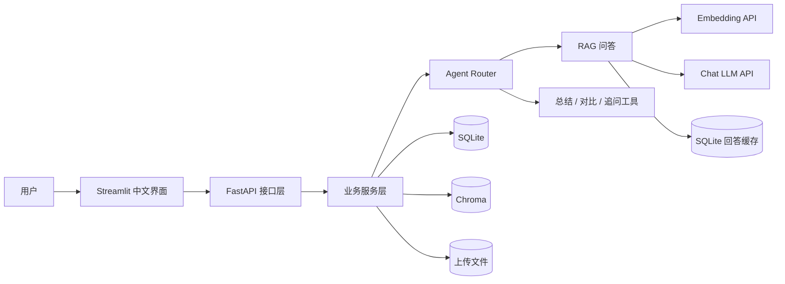

# KnowFlow AI

[](https://github.com/xibeiqiaozhilang-bot/knowflow-ai/actions/workflows/ci.yml)

KnowFlow AI 是一个使用 Python 开发的企业知识库 RAG 问答平台，面向 Agent
工程师和 AI 应用开发工程师岗位的应届生项目展示。

项目采用 FastAPI + Streamlit 的前后端结构，实现了从知识库管理、文档切分、
Embedding 和语义检索，到带引用问答、轻量 Agent Router、执行记录与 Docker
部署的完整链路。设计重点是结构清晰、流程可解释、能够测试，而不是堆叠复杂功能。

## 核心能力

- 知识库创建、查询和删除
- TXT、Markdown、文本型 PDF 上传与元信息管理
- 上传文件分块写盘、10 MB 默认限制和异常残留文件清理
- 文本清洗、可配置 Chunk 切分和位置记录
- OpenAI 兼容 Embedding 接口与 Chroma 向量索引
- 候选扩大召回、重复正文去重与无额外模型调用的轻量词法 Rerank
- 文档重处理时同步清理旧向量，并使旧摘要和 FAQ 失效
- 删除知识库时级联清理 SQLite、Chroma 与上传文件
- 带引用来源、资料不足判断和会话历史的 RAG 问答
- 高频精确问题回答缓存，支持 TTL、主动失效和 LRU 容量淘汰
- 普通问答、文档总结、多文档对比和信息追问的轻量 Agent Router
- Agent 执行步骤、检索日志和模型 Token 用量记录
- 请求 ID、存活/就绪检查和模型调用超时保护
- 基于人工标注题目的离线检索评估（Hit Rate@K、MRR、关键词召回率）
- 回答反馈、文档摘要和自动 FAQ
- Streamlit 中文演示页面
- Docker Compose 一键启动与 GitHub Actions 自动化测试

PDF 当前支持提取文本和保留页码标记，但扫描件尚未接入 OCR。
PostgreSQL + pgvector、用户登录和异步任务属于后续升级项。

## 系统架构



三类存储各自负责不同数据：

- SQLite 保存知识库、文档、Chunk 正文、回答缓存、会话、日志和引用关系，是业务数据来源。
- Chroma 保存 Chunk 向量、检索 metadata 和索引副本，负责语义相似度召回。
- 文件目录保存用户上传的原始文档，数据库只记录其存储路径和元信息。

详细设计见[系统架构说明](docs/system_architecture.md)。

## 核心数据流

### 文档建索引

```text
上传文档
→ 保存原文件和 documents 元信息
→ 解析、清洗并切分 Chunk
→ 将 Chunk 正文保存到 SQLite
→ 调用 Embedding 模型生成向量
→ 将向量和定位 metadata 写入 Chroma
→ 在 vector_indexes 记录 Chunk 与 Chroma 的映射
```

### RAG 问答

```text
用户问题
→ Agent Router 判断意图
→ 生成包含知识库、问题、Top-K、模型与 Prompt 版本的缓存键
→ 命中有效缓存时直接复用回答和证据，跳过 Embedding 与 Chat LLM
→ 未命中时进入正常 RAG 流程
→ 问题向量化
→ Chroma 在指定知识库内扩大召回候选
→ 根据 metadata 回查 SQLite 中的 Chunk 和文档来源
→ 去除同一文档中的重复正文
→ 融合向量分数与词法覆盖率执行轻量 Rerank
→ 截取最终 Top-K
→ 判断检索依据是否充足
→ 构造带编号资料的 RAG Prompt
→ LLM 生成带引用回答
→ 保存消息、引用、检索日志、执行步骤和 Token 用量
```

## 技术栈

| 模块 | 技术 | 职责 |
| --- | --- | --- |
| 后端 API | FastAPI | 接收请求、参数校验、依赖注入和 OpenAPI 文档 |
| 前端 | Streamlit | 提供中文知识库管理、文档处理和问答界面 |
| ORM | SQLAlchemy | 映射 Python 模型与关系型数据库表 |
| 业务数据库 | SQLite | 保存结构化业务数据和 Chunk 正文 |
| 向量数据库 | Chroma | 保存 Embedding 并执行语义检索 |
| 文档解析 | pypdf | 提取文本型 PDF，并保留页码标记 |
| 模型接口 | OpenAI 兼容 API | 提供 Chat Completion 和 Embedding |
| 配置 | pydantic-settings + `.env` | 隔离环境配置和真实密钥 |
| 测试 | pytest | 验证服务、RAG 和 Agent 业务流程 |
| 部署 | Docker Compose | 统一后端、前端和持久化目录 |
| CI | GitHub Actions | 每次推送自动执行后端测试和前端检查 |

## 项目结构

```text
knowflow-ai/
├── .github/workflows/       # GitHub Actions 工作流
├── backend/
│   ├── app/
│   │   ├── api/             # FastAPI 路由
│   │   ├── core/            # 配置与日志
│   │   ├── db/              # SQLAlchemy 会话与基类
│   │   ├── models/          # 数据库模型
│   │   ├── repositories/    # 数据访问层
│   │   ├── schemas/         # API 输入输出模型
│   │   ├── services/        # RAG、Agent 和文档业务逻辑
│   │   └── main.py          # FastAPI 应用入口
│   ├── tests/               # pytest 测试
│   ├── scripts/             # 离线检索评估等工程脚本
│   ├── .env.example         # 后端配置模板
│   └── Dockerfile
├── frontend/
│   ├── core/                # 前端配置
│   ├── services/            # FastAPI 客户端
│   ├── views/               # Streamlit 页面
│   ├── app.py               # Streamlit 入口
│   └── Dockerfile
├── docs/                    # 中文阶段文档和架构说明
├── evaluation/              # 可版本化的检索评估集
├── sample_data/             # 可公开使用的测试知识库
└── docker-compose.yml
```

## 快速启动

### 1. 克隆项目

```powershell
git clone https://github.com/xibeiqiaozhilang-bot/knowflow-ai.git
cd knowflow-ai
```

### 2. 创建模型配置

```powershell
Copy-Item backend/.env.example backend/.env
```

在 `backend/.env` 中配置可用的 OpenAI API 或兼容接口：

```dotenv
CHAT_API_KEY=your_chat_api_key
CHAT_BASE_URL=https://your-chat-provider.example/v1
CHAT_MODEL=your_chat_model

EMBED_API_KEY=your_embedding_api_key
EMBED_BASE_URL=https://your-embedding-provider.example/v1
EMBED_MODEL_NAME=your_embedding_model
```

真实 `.env` 已被 Git 和 Docker 构建上下文忽略，不要把密钥写入源码或文档。

### 3. 使用 Docker Compose 启动

```powershell
docker compose up --build
```

启动完成后访问：

- Streamlit 页面：<http://127.0.0.1:8501>
- FastAPI 文档：<http://127.0.0.1:8000/docs>
- 健康检查：<http://127.0.0.1:8000/api/health>
- 就绪检查：<http://127.0.0.1:8000/api/health/ready>

可以上传 [sample_data/knowflow_demo_handbook.md](sample_data/knowflow_demo_handbook.md)
体验切分、索引、检索和问答流程。

Docker 数据保存在命名卷 `knowflow_data` 中，删除并重新创建容器后，
SQLite、Chroma 和上传文件仍会保留。详细说明见
[Docker 部署文档](docs/stage_09_docker_deployment.md)。

## 本地开发

后端：

```powershell
cd backend
python -m venv .venv
.\.venv\Scripts\Activate.ps1
python -m pip install -r requirements.txt
uvicorn app.main:app --reload
```

前端：

```powershell
cd frontend
python -m pip install -r requirements.txt
streamlit run app.py
```

前端默认访问 `http://127.0.0.1:8000/api`，可以通过 `API_BASE_URL` 修改。

## 测试与持续集成

本地运行后端测试：

```powershell
cd backend
.\.venv\Scripts\python.exe -m pytest
```

项目现有 50 个测试，覆盖健康检查、知识库与文档、Chunk、向量索引、
RAG 问答、Agent Router、执行历史、反馈、摘要、FAQ、模型用量和
多存储一致性。生命周期测试会验证旧向量清理、数据库失败补偿、
派生数据失效、SQLite 外键和内部路径隐藏；可靠性测试还覆盖流式上传、
PDF 解析、请求追踪、模型超时、检索评估指标和回答缓存生命周期。

GitHub Actions 会在推送到 `main`、创建 Pull Request 或手动触发时，
自动执行后端 pytest 和前端 Python 语法检查。详见
[CI 学习文档](docs/stage_09_github_actions_ci.md)。

## 设计取舍

- Router 第一版使用显式规则，便于初学者观察、测试和解释；后续可替换为 LLM 分类。
- SQLite 与 Chroma 分工存储，避免把业务正文完全绑定到某一种向量数据库。
- SQLite 内部变更使用事务；Chroma 写入后若数据库失败，则执行补偿删除。
- 文档重切分会使向量、摘要和 FAQ 一起失效，避免使用旧 Chunk 派生结果。
- 检索先扩大候选集再去重，避免重复正文占满最终 Top-K。
- RAG 在最佳检索距离超过阈值时直接返回“知识库中没有足够依据”，减少无依据回答。
- 摘要、FAQ 和多文档对比会调用 LLM；普通语义检索只调用 Embedding。
- 评估集使用文件名和关键事实词标注，不绑定会随重切分变化的 Chunk ID。
- 存活检查只表示进程可响应；就绪检查还验证 SQLite 和 Chroma 可访问。
- 回答缓存只匹配规范化后完全相同的问题；TTL、配置签名和索引变更失效共同防止旧答案复用，
  单知识库与全局容量上限通过 LRU 批量淘汰避免缓存表无限增长。
- 轻量词法 Rerank 只重排扩大召回候选，不增加模型调用；正确证据未进入候选时不会伪造提升。
- 项目暂不加入复杂权限、多租户和多 Agent 编排，优先保证完整性与可讲解性。

## 中文文档

- [系统架构说明](docs/system_architecture.md)
- [中文接口文档](docs/api_reference.md)
- [RAG 工程加固](docs/stage_09_rag_hardening.md)
- [可靠性与检索评估](docs/stage_09_reliability_and_evaluation.md)
- [RAG 高频回答缓存](docs/stage_10_rag_answer_cache.md)
- [轻量词法 Rerank 与对比评估](docs/stage_11_lightweight_rerank.md)
- [简历与面试讲解](docs/resume_project_guide.md)
- [RAG 问答阶段](docs/stage_05_rag_chat.md)
- [Streamlit 页面阶段](docs/stage_06_streamlit_ui.md)
- [Agent Router 阶段](docs/stage_07_agent_router.md)
- [Docker 部署阶段](docs/stage_09_docker_deployment.md)
- [GitHub Actions CI](docs/stage_09_github_actions_ci.md)

## 后续计划

- 增加 PostgreSQL + pgvector 迁移方案
- 补充用户登录与知识库访问控制
- 增加 BM25 混合召回，并在独立测试集上比较轻量词法与 Cross-Encoder Rerank
- 将文档处理迁移到后台异步任务队列
- 为扫描版 PDF 增加 OCR
