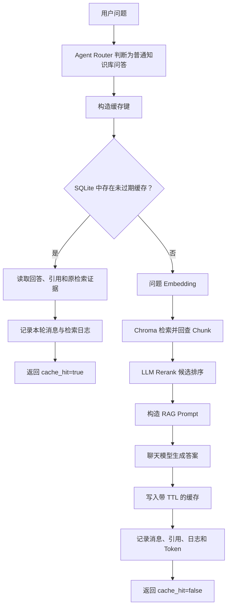

# RAG 高频回答缓存

## 1. 缓存目标

企业知识库中经常会重复出现“请假需要什么材料”“报销期限是多少”这类问题。
如果每次都完整执行 RAG，会重复产生以下成本：

1. 调用 Embedding 模型，把同一个问题再次向量化。
2. 查询 Chroma，并回查 SQLite 中的 Chunk 和来源。
3. 调用 LLM Rerank 对候选排序，再调用回答模型生成近似答案。

当前链路增加持久化回答缓存。第一次提问仍执行完整 RAG；相同请求再次出现时，
系统直接返回已经验证过的回答、引用和检索证据，同时继续保存本轮会话与日志。

## 2. 为什么使用精确缓存

当前缓存会先规范化问题：去掉首尾空白、合并连续空白并转成小写，然后进行完全匹配。

例如：

```text
"员工请假需要什么材料？"
"  员工请假需要什么材料？  "
```

二者会得到相同的规范化问题，因此可以命中同一条缓存。

但“员工请假要哪些证明”和“请假需要什么材料”不会被当成同一个问题。后者属于
语义缓存，需要额外生成向量并设置相似度阈值；阈值过宽还可能把含义不同的问题错误复用。
精确缓存节省更多调用、行为容易解释，也适合当前项目规模。

## 3. 请求数据流



缓存命中后跳过 Embedding、Chroma、LLM Rerank 和回答模型，所以同时减少模型 Token、网络等待和
向量检索耗时。数据库读写仍然存在，因为系统需要保留完整会话和可观测记录。

## 4. 缓存键为什么不能只有问题

如果只用问题文本作键，同一句“报销期限是多少”可能错误复用另一个知识库的答案。
当前缓存键由以下信息计算 SHA-256：

| 组成部分 | 作用 |
| --- | --- |
| `knowledge_base_id` | 隔离不同知识库 |
| 规范化问题 | 识别重复提问 |
| `top_k` | 检索数量改变时重新生成 |
| Chat/Embedding 模型名 | 模型切换后不复用旧结果 |
| 距离阈值与候选倍数 | 检索策略改变后重新生成 |
| Rerank 策略、模型、候选上限与 Prompt 版本 | 排序条件改变后重新生成 |
| Prompt 哈希 | Prompt 修改后自动生成新键 |
| 缓存版本号 | 业务规则大改时手动整体换代 |

这叫“配置签名”。它解决的核心问题是：文字相同，不代表生成答案所依赖的运行条件相同。

## 5. 数据库保存什么

`rag_answer_caches` 表保存：

- 缓存键、知识库 ID、规范化问题和 Top-K；
- 回答、引用、检索片段和资料不足标记；
- 首次生成时 LLM Rerank 与回答模型消耗的总 Token；
- 过期时间、命中次数和最后命中时间。

引用与检索片段使用 JSON 字段保存，是因为它们是缓存结果的结构化快照。真正的 Chunk 主数据
仍然在 `document_chunks`，缓存不是业务数据的唯一来源。

## 6. 如何避免返回旧答案

项目使用三层防护：

1. **TTL**：缓存默认一小时过期，过期记录不会命中。
2. **配置签名**：模型、检索参数或 Prompt 变化后，缓存键自动变化。
3. **主动失效**：重新切分文档或建立向量索引前，删除该知识库的所有回答缓存。

主动失效发生在内容变更之前并立即提交。这样即使后续索引失败，也只是暂时没有缓存，
不会继续返回与当前索引状态不一致的旧答案。这是一种“正确性优先于命中率”的取舍。

删除知识库时，数据库外键级联删除对应缓存。

## 7. TTL、容量限制和 LRU

读取缓存时只返回 `expires_at` 晚于当前时间的记录。写入新缓存后，Repository 会顺便删除
已经过期的记录，这叫惰性清理。

当前没有增加定时任务，因为项目规模较小。生产环境数据量大时，可以由后台任务周期清理，
或者直接使用 Redis 的原生过期机制。

TTL 只能限制一条记录活多久，不能阻止一小时内出现大量不同问题。项目因此增加两层容量限制：

```dotenv
RAG_ANSWER_CACHE_MAX_ENTRIES=2000
RAG_ANSWER_CACHE_MAX_ENTRIES_PER_KB=500
```

每次写入后的处理顺序是：

```text
删除过期记录
→ 淘汰当前知识库超出上限的记录
→ 淘汰全局超出上限的记录
→ 一次提交清理事务
```

淘汰采用 LRU 思路：命中过的记录按 `last_hit_at` 判断最近使用时间，从未命中的记录按最近写入时间
判断；时间相同再按主键顺序保证结果稳定。Repository 只删除超出的数量，而不是容量一满就清空全部
缓存。单知识库上限还会自动受全局上限约束。

## 8. 可观测性

后端新增两个接口：

```text
GET    /api/knowledge-bases/{knowledge_base_id}/cache/stats
DELETE /api/knowledge-bases/{knowledge_base_id}/cache
```

页面可以查看有效条目数、累计命中次数、估算节省的模型 Token、TTL 和两层容量上限，也可以手动清空缓存。

“估算节省 Token”按首次生成时的 LLM Rerank 与回答模型总 Token 乘以命中次数计算。它没有包含
Embedding Token，因此是保守估算；也不能直接等同于节省金额，金额还取决于模型计价。

## 9. 关键文件

| 文件 | 职责 |
| --- | --- |
| `backend/app/models/rag_answer_cache.py` | 定义缓存表 |
| `backend/app/repositories/rag_answer_cache_repository.py` | 封装查询、写入、命中计数、统计、LRU 和删除 |
| `backend/app/services/rag_answer_cache_service.py` | 规范化问题、生成缓存键、控制 TTL、容量和失效 |
| `backend/app/services/rag_chat_service.py` | 在普通 RAG 前读取缓存，完成后回写缓存 |
| `backend/app/services/document_chunk_service.py` | 文档重新切分前使缓存失效 |
| `backend/app/services/document_vector_index_service.py` | 建立新索引前使缓存失效 |
| `backend/app/api/chat.py` | 提供缓存统计和清空接口 |
| `frontend/views/chat_page.py` | 展示缓存命中状态和统计 |
| `backend/tests/test_rag_answer_cache.py` | 验证命中、隔离、过期和主动失效 |

## 10. 本地 Docker 实机样本

在同一个已索引知识库中连续询问“连续病假超过三个工作日需要什么材料？”：

| 请求 | `cache_hit` | 耗时 | 模型用量 |
| --- | --- | --- | --- |
| 首次成功请求 | `false` | 约 10.6 秒 | 898 Token |
| 随后相同请求 | `true` | 约 114 毫秒 | 0 Token |

缓存命中响应保留了 3 条引用，缓存统计同时记录 1 次命中和估算节省 898 个聊天 Token。
这个结果能证明当前代码路径确实跳过了外部模型，但它只是本机的一次功能性样本，受网络和模型服务
波动影响，不能写成稳定的平均延迟。正式性能结论还需要固定数据集、多轮压测并报告 P50/P95。

## 11. 测试重点

测试覆盖：

1. 同一个问题第二次请求不会再次调用搜索服务、LLM Rerank 和回答模型。
2. 缓存命中后仍然保存用户消息、助手消息和检索日志。
3. 不同 Top-K 不会共用缓存。
4. TTL 过期后重新执行完整 RAG，并刷新原记录。
5. 文档重新切分和重建索引都会清空所属知识库缓存。
6. 单知识库超过容量时保留最近命中的缓存。
7. 多个知识库合计超过全局容量时淘汰全局最旧记录。

测试曾发现：先删除过期 ORM 对象、再在同一事务插入新对象时，SQLite 可能复用主键，导致
SQLAlchemy identity map 警告。最终调整为先更新同一缓存键，再清理其他过期记录，并让
`pytest -W error` 把此类警告也作为失败处理。这是缓存生命周期与 ORM 会话交互的真实工程问题。

## 12. 当前边界和升级方向

当前使用 SQLite 持久化缓存，适合单机部署和受控内部工作负载。多个后端实例并发访问时，还缺少：

- Redis 共享缓存；
- 分布式锁或 singleflight，避免热点缓存同时失效后重复请求模型；
- TTL 随机抖动，降低大量缓存同一时刻失效的风险；
- 热点问题排行榜和真实延迟分位数监控；
- 经过评估集验证的语义缓存。

对外说明系统能力时，应明确这些是升级方向，而不是已经实现的功能。

## 13. 实现总结

- 缓存不是简单的 `question -> answer` 字典，必须考虑作用域、配置、过期、容量和数据变更。
- RAG 缓存命中可以同时跳过 Embedding、向量检索、LLM Rerank 和回答模型。
- 缓存属于派生数据，知识库内容变化后可以删除并重新生成。
- 缓存命中不应破坏会话持久化、引用溯源和可观测性。
- 优化效果要通过命中次数、Token 和延迟数据说明，不能只说“加了缓存所以更快”。

## 14. 工程成果与适用边界

工程成果可概括为：

> 设计基于 SQLite 的 RAG 高频问答缓存，使用知识库、规范化问题、检索参数、模型与 Prompt
> 签名构造缓存键，并通过 TTL、索引变更主动失效和两级 LRU 容量治理避免旧答案与缓存膨胀；
> 缓存命中时跳过 Embedding、Chroma、LLM Rerank 与回答模型调用，同时保留会话和检索日志。

方案优先保证正确性，再优化性能：缓存键阻止跨知识库复用，索引变更触发主动失效，命中后仍写入
会话与检索日志以保持审计链完整。高并发多实例部署时，应迁移到 Redis 并增加分布式锁防止缓存击穿。
