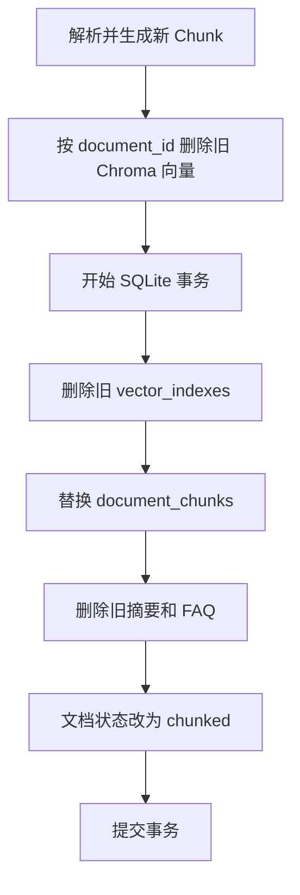

# 第九阶段：RAG 索引生命周期与工程加固

## 1. 为什么要做这次优化

RAG 项目不只使用一种存储：

- SQLite 保存业务数据和 Chunk 正文；
- Chroma 保存向量和检索 metadata；
- uploads 保存原始文件；
- 摘要与 FAQ 是基于 Chunk 生成的派生数据。

如果只修改其中一处，就可能出现“数据库里已经没有 Chunk，但 Chroma 仍能召回旧向量”
或“文档已经更新，页面还在展示旧摘要”的问题。

这类问题叫做多存储一致性问题，比新增一个页面功能更能体现 AI 应用工程能力。

## 2. 优化前的问题

### 重复切分留下旧向量

原流程会替换 SQLite 中的 Chunk，却不会删除 Chroma 中旧 `chunk_id` 对应的向量。
检索时这些向量仍可能占据 Top-K，后端回查 SQLite 又找不到正文，最终返回结果变少。

### 摘要和 FAQ 过期

摘要与 FAQ 来自旧 Chunk。文档重新切分后，它们虽然仍能查询，但引用已经不再可靠。

### 删除知识库留下外部数据

SQLAlchemy 可以删除关系型关联数据，但 Chroma 和原始文件不属于同一数据库，
不会自动跟随 ORM 关系删除。

### 重复正文占满 Top-K

Chunk overlap 或原文重复段落可能产生相同正文。如果 Top-K 都是重复内容，
LLM 得到的参考资料缺乏信息增量，页面引用也显得重复。

### API 暴露内部路径

`storage_path` 是后端读取文件所需的内部字段，Streamlit 不需要知道容器或服务器路径。
将它返回给客户端会泄漏部署目录结构。

## 3. 文档重处理流程



解析放在清理之前。这样文档为空、编码错误或格式不支持时，原有索引不会被破坏。

SQLite 相关变更只提交一次：

- 旧映射删除；
- 旧 Chunk 删除；
- 新 Chunk 插入；
- 摘要和 FAQ 失效；
- 文档状态更新。

任一步骤抛出异常时执行 `rollback`。

## 4. 建索引失败补偿

Chroma 和 SQLite 无法共享事务，因此建索引采用补偿策略：

```text
Embedding 成功
→ Chroma upsert 成功
→ SQLite 写映射和状态
→ 如果 SQLite 提交失败
→ 按本次 chroma_id 删除已经写入的向量
```

这不是严格的分布式事务，但能处理当前项目最关键的部分失败场景。
如果系统未来升级为异步任务，可以进一步使用任务状态、重试和对账任务。

## 5. 知识库删除

删除顺序是：

```text
清理 Chroma
→ 删除 SQLite 主数据
→ 清理上传文件
```

Chroma 清理失败时中止删除，保留 SQLite 主数据，用户可以重试。

文件删除前会执行路径安全检查：目标路径必须位于 `UPLOAD_DIR` 内。
数据库中即使出现异常路径，也不会删除上传根目录之外的文件。

## 6. SQLite 外键

SQLite 支持外键定义，但默认不会执行约束。项目为每条 SQLite 连接执行：

```sql
PRAGMA foreign_keys=ON;
```

同时，Chunk Repository 显式删除对应的 `vector_indexes`。
外键约束和业务清理逻辑共同降低孤立记录风险。

## 7. 检索去重

最终需要 `top_k` 条结果时，系统先召回：

```text
candidate_top_k = top_k × RETRIEVAL_CANDIDATE_MULTIPLIER
```

默认倍数是 3。回查 SQLite 后，以以下组合为去重键：

```text
(document_id, normalized_content)
```

`normalized_content` 会合并空白并统一大小写。

去重范围限定在同一文档内，因此不同文档包含相同制度内容时，仍可以作为两个独立来源。
当前只去除完全重复正文，不尝试用复杂阈值删除相似段落，避免误删有效信息。

## 8. DTO 安全边界

数据库 `Document` Model 继续保存 `storage_path`，因为解析器需要读取原文件。
API 的 `DocumentRead` Schema 删除该字段，因为客户端不需要它。

这说明 Model 和 Schema 不是同一个概念：

- Model 负责内部持久化；
- Schema 负责对外接口合同；
- 对外响应遵循最少必要字段原则。

## 9. 自动化测试

项目测试从 24 个增加到 29 个，新增覆盖：

1. Chroma 按文档和知识库清理。
2. 语义检索扩大候选集并去除重复正文。
3. SQLite 写入失败时补偿删除 Chroma 向量。
4. 文档重处理使旧映射、摘要和 FAQ 失效。
5. 知识库删除清理向量和原始文件。
6. SQLite 外键开关确实启用。
7. API 响应不包含内部 `storage_path`。

完整测试使用 `pytest -W error` 运行，SQLAlchemy 警告也会导致失败。

## 10. 学习总结

完成本阶段后，应能讲清楚：

- 为什么 RAG 的索引不是一次性数据，而有完整生命周期；
- 为什么 Chroma 和 SQLite 不能共享普通数据库事务；
- 什么是补偿操作；
- 为什么上游 Chunk 变化后，摘要和 FAQ 必须失效；
- 为什么检索去重前要先扩大候选集；
- 为什么 API Schema 不应暴露所有数据库字段。

## 11. 简历表述

> 设计 RAG 索引生命周期治理机制，在文档重处理和知识库删除场景下联动清理
> SQLite、Chroma 与原始文件；通过数据库事务、失败补偿和派生数据失效策略
> 降低悬空向量与过期引用风险，并实现候选扩大召回与重复 Chunk 去重。

## 12. 面试追问

### 为什么不使用一个事务同时控制 SQLite 和 Chroma？

它们是两个独立存储系统，SQLite 的事务无法回滚 Chroma 操作。
当前方案把 SQLite 作为业务主数据，在关键失败路径执行 Chroma 补偿删除。

### 为什么数据库提交失败时删除本次 Chroma 向量？

因为 SQLite 没有保存映射和状态，保留向量会形成无法管理的悬空记录。

### 为什么只做完全重复去重？

完全重复的判断稳定、可测试。相似度去重需要额外阈值和评估集，当前项目没有足够数据
证明某个阈值不会误删有效片段，因此先选择风险更低的策略。

### 文件清理失败为什么只记录日志？

此时 SQLite 主数据已经删除，返回失败也无法通过同一资源 ID 重试。
原始文件残留不会参与检索，因此记录异常并交给后续运维清理比返回半失败更合理。
