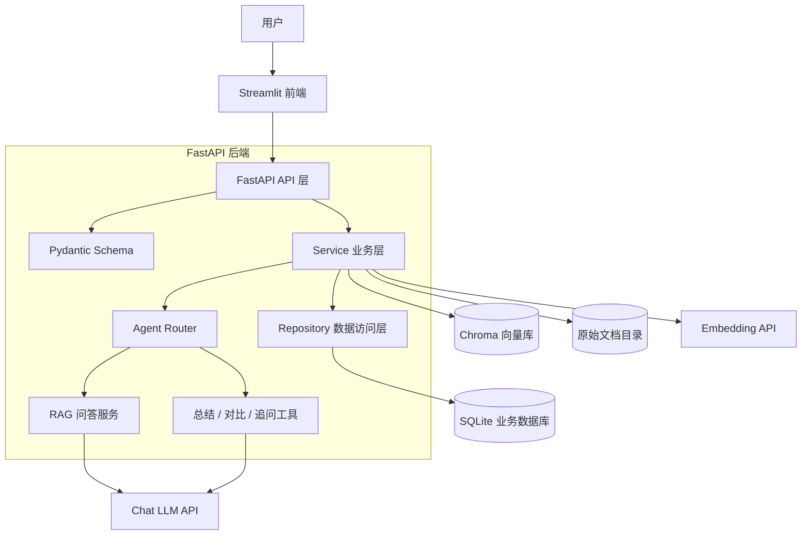
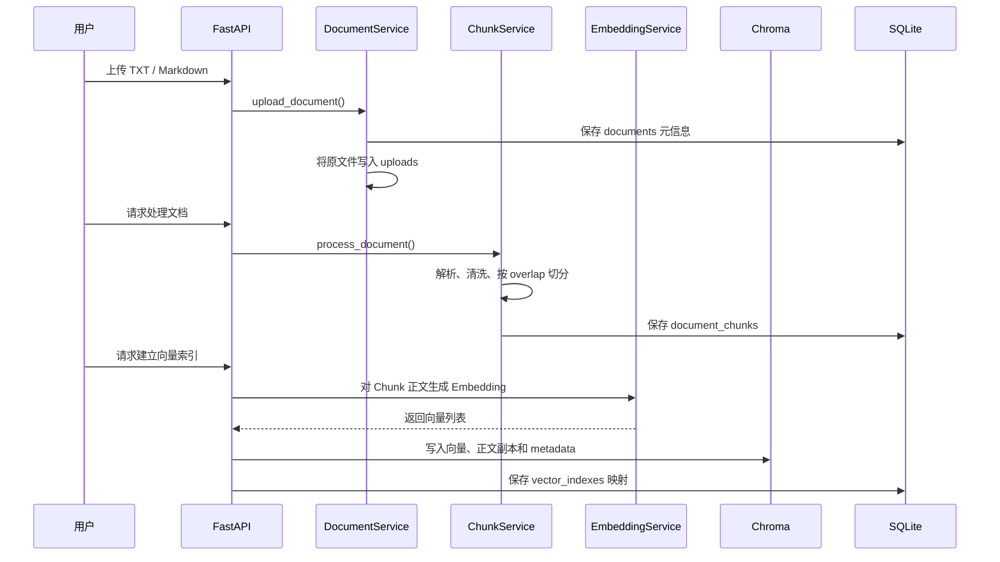
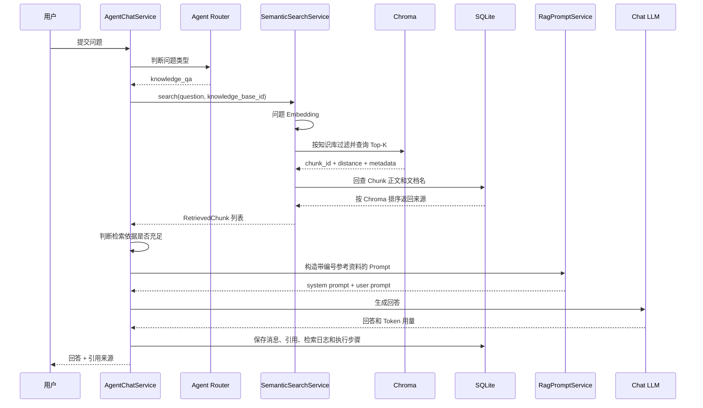
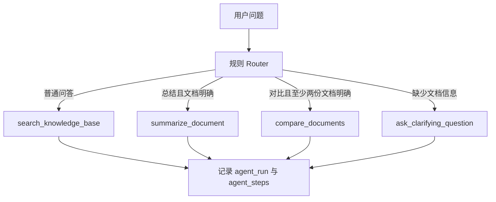
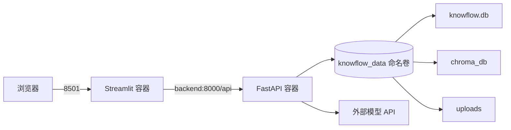

# KnowFlow AI 系统架构说明

## 1. 架构目标

KnowFlow AI 是一个简化但完整的企业知识库 RAG 问答项目。架构设计遵循以下原则：

1. 前端、接口、业务逻辑和数据访问职责分离。
2. 关系型业务数据与向量索引分开管理。
3. RAG 和 Agent 执行过程可以记录、测试和解释。
4. 模型、数据库和向量库未来可以替换，但不要求一次实现所有企业功能。

## 2. 整体架构



请求从 Streamlit 发往 FastAPI。API 层只负责 HTTP 协议和参数校验，
Service 层负责组织业务流程，Repository 层负责执行数据库读写。

## 3. 后端分层

### API 层

目录：`backend/app/api`

API 层负责：

- 定义 URL、HTTP 方法和状态码；
- 使用 Pydantic Schema 校验输入和输出；
- 通过 FastAPI 依赖注入获得数据库 Session；
- 调用对应 Service；
- 将业务结果转换为 HTTP 响应。

API 层不直接编写复杂检索、Prompt 或 SQL 逻辑。

### Schema 层

目录：`backend/app/schemas`

Schema 是接口的数据合同。例如聊天接口需要知道用户问题、会话 ID 和 Top-K，
返回值需要包含回答、引用来源、Agent 意图和执行步骤。

数据库 Model 描述“数据怎样保存”，Schema 描述“接口怎样接收和返回”，
两者职责不同。

### Service 层

目录：`backend/app/services`

Service 是项目的核心业务层，主要包含：

- 文档上传、解析、切分和索引；
- Embedding 调用与 Chroma 操作；
- 语义检索与 SQLite 来源回查；
- RAG Prompt 构造与 LLM 问答；
- Agent 意图路由和工具调用；
- 摘要、FAQ、反馈和模型用量记录。

### Repository 层

目录：`backend/app/repositories`

Repository 封装 SQLAlchemy 查询，让 Service 使用
`get_by_id`、`list_by_document`、`create` 等业务含义明确的方法。

这样以后从 SQLite 升级到 PostgreSQL 时，大部分 Service 流程不需要重写。

### Model 与数据库层

目录：`backend/app/models`、`backend/app/db`

Model 定义数据库表、字段和关系，数据库层负责 Engine、Session 和建表入口。

## 4. 文档建索引流程



只有 `document_chunks.content` 参与向量化。`document_id`、
`knowledge_base_id` 和 `chunk_index` 不参与语义计算，而是作为 metadata
写入 Chroma，用于知识库过滤和来源定位。

`vector_indexes` 记录 SQLite Chunk 与 Chroma 记录之间的映射。
如果未来把 Chroma 替换为 pgvector，原始文档、Chunk 正文和业务关系仍在
SQLite/PostgreSQL 中，不需要重新设计整个文档数据模型。

## 5. RAG 问答流程



### 为什么还要回查 SQLite

Chroma 的主要职责是根据向量距离找到候选记录。命中后，系统使用 metadata
中的 `chunk_id` 回到 SQLite，读取最终 Chunk 正文和文档信息。

这样做有三个好处：

1. SQLite 是业务数据的统一来源。
2. 可以检查 Chunk 是否仍属于当前知识库。
3. Chroma 更换或重建时不会影响会话、文档和引用关系。

### 资料不足判断

系统读取排序第一的 Chunk 距离。如果没有命中，或最佳距离大于配置阈值，
则不调用聊天模型，直接返回：

```text
知识库中没有足够依据。
```

这是一种简单、可解释的回答边界，不等于完整的 RAG 质量评估。

## 6. Agent Router



第一版 Router 使用关键词和文件名匹配，而不是调用 LLM 分类。

这是有意的工程取舍：

- 路由结果稳定，方便编写单元测试；
- 初学者可以观察输入、决策、工具和输出；
- 不会为简单分类增加一次模型费用；
- 未来可以将 Router 内部替换为 LLM，但继续输出统一的 `AgentRouteDecision`。

它已经具备 Agent 的核心闭环：接收目标、判断意图、选择工具、执行工具并记录步骤。
它不是完整 ReAct Agent，因为当前不会在执行后进行多轮观察、重新规划和反思。

## 7. 数据存储分工

| 存储 | 保存内容 | 为什么这样设计 |
| --- | --- | --- |
| SQLite | 知识库、文档、Chunk、会话、消息、引用、日志 | 支持结构化查询、关联和事务 |
| Chroma | 向量、Chunk 正文副本、定位 metadata | 支持语义相似度检索 |
| uploads | 用户上传的原始文件 | 避免把文件二进制直接放入数据库 |
| `.env` | 模型地址、模型名和 API Key | 将密钥与源码分离 |

主要数据库表可以分为：

- 知识库：`knowledge_bases`、`documents`、`document_chunks`、`vector_indexes`
- 问答：`conversations`、`messages`、`retrieval_logs`
- Agent：`agent_runs`、`agent_steps`
- 增强功能：`answer_feedbacks`、`document_summaries`、`document_faqs`
- 可观测性：`model_usage_logs`

## 8. 引用溯源

引用不是让 LLM 自己猜文件名，而是由后端生成：

1. Chroma 返回匹配向量的 `chunk_id`。
2. 后端从 SQLite 读取 Chunk 正文、文件名和位置。
3. `RagPromptService` 给资料编号 `[1]`、`[2]`、`[3]`。
4. LLM 按编号回答。
5. 后端将同一批引用结构化保存到消息和检索日志。
6. Streamlit 展示文件名、Chunk、距离和正文。

因此页面上的引用编号可以追溯到真实数据库记录。

## 9. RAG 索引生命周期与多存储一致性

SQLite、Chroma 和上传目录不是同一个数据库，无法共享一个 ACID 事务。
系统因此采用“明确主数据、事务提交、失败补偿和派生数据失效”的策略。

### 文档重新切分

```text
新文本解析和切分成功
→ 按 document_id 删除旧 Chroma 向量
→ 开启 SQLite 事务
→ 删除旧 vector_indexes 和 document_chunks
→ 删除基于旧 Chunk 生成的摘要与 FAQ
→ 插入新 Chunk，并将状态改为 chunked
→ 提交事务
```

先完成新文本解析再清理旧数据，避免格式或编码错误导致已有索引被提前删除。
SQLite 中的替换、派生数据清理和状态更新只提交一次，任一步失败都会回滚。

### 建立向量索引

```text
生成 Embedding
→ upsert 到 Chroma
→ 在一个 SQLite 事务中写 vector_indexes 并更新文档状态
→ 数据库提交失败时，按 chroma_id 补偿删除本次向量
```

补偿操作不能达到分布式事务的严格原子性，但能避免大多数“Chroma 已写入、
SQLite 未记录”的悬空状态，复杂度也适合当前项目规模。

### 删除知识库

```text
按 knowledge_base_id 清理 Chroma
→ 删除 SQLite 知识库及关联数据
→ 在上传根目录安全边界内删除原始文件
```

如果 Chroma 清理失败，系统不会继续删除 SQLite 主数据。文件清理只允许发生在
配置的上传根目录中，防止异常 `storage_path` 删除项目之外的文件。

### SQLite 外键

SQLite 默认关闭外键约束。项目在每条数据库连接创建时执行
`PRAGMA foreign_keys=ON`，同时 Repository 仍显式清理向量映射，形成双重保护。

## 10. Docker 运行架构



Docker Compose 创建前后端两个容器。前端使用 Compose 服务名 `backend`
访问后端，而浏览器通过宿主机端口访问页面。命名卷负责持久化数据库、
向量索引和上传文档。

## 11. 可替换边界

### Chroma 升级 pgvector

保留 Document、Chunk 和引用模型，替换向量存储实现以及
`vector_indexes` 的映射方式。

### SQLite 升级 PostgreSQL

调整数据库连接、迁移工具和少量数据库特性，Service 继续通过 Repository
访问数据。

### 规则 Router 升级 LLM Router

保留 `AgentRouteDecision` 和工具接口，只替换意图判断实现，并增加结构化输出校验。

### Streamlit 升级独立前端

FastAPI 接口合同保持不变，可以将 Streamlit 替换为 React 或 Vue。

## 12. 当前边界

- 仅支持 TXT 和 Markdown，尚未实现 PDF 页码解析。
- 未实现登录、多租户和细粒度知识库权限。
- 未实现混合检索、Rerank 和系统化检索评估。
- SQLite + Chroma 适合本地演示，不代表高并发生产部署方案。
- Router 是单次决策，不包含完整 ReAct 循环和自主反思。

清楚说明边界比把项目包装成“大型企业平台”更适合应届生面试。

## 13. 三分钟面试讲解

可以按照以下顺序介绍：

1. **项目目标**：完成一个可运行、可溯源、可观察的企业知识库 RAG 平台。
2. **索引链路**：原文保存、Chunk 切分、Embedding、Chroma 和映射记录。
3. **问答链路**：问题向量化、知识库过滤、SQLite 回查、Prompt 和引用。
4. **Agent 能力**：Router 在问答、总结、对比和追问工具之间进行选择。
5. **工程能力**：FastAPI 分层、SQLAlchemy、pytest、Docker Compose 和 CI。
6. **一致性设计**：说明重切分失效、SQLite 事务和 Chroma 失败补偿。
7. **设计取舍**：保持轻量和可解释，并说明未来升级 PostgreSQL、pgvector 和 LLM Router 的边界。
